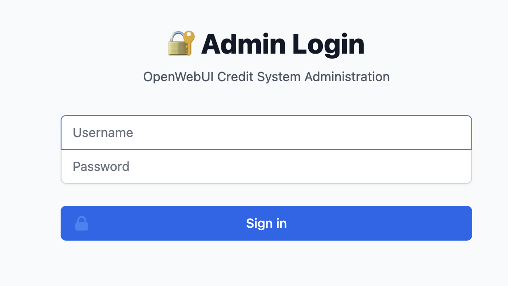
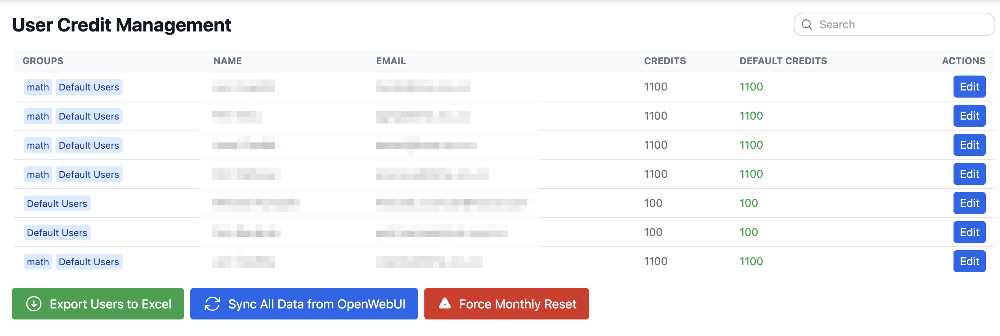
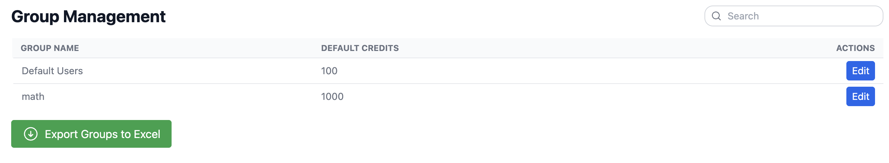
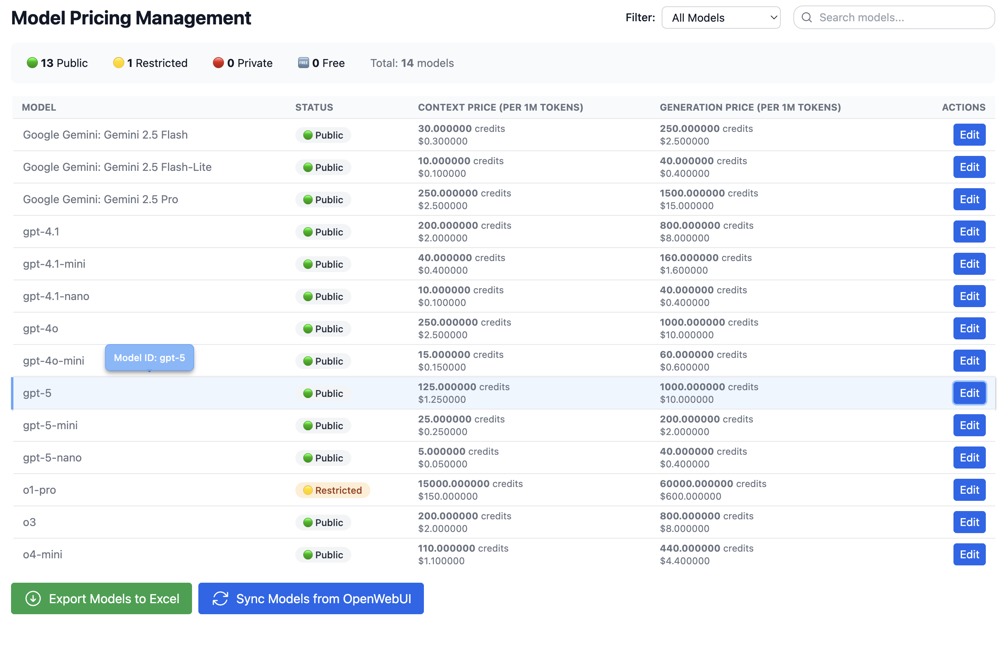
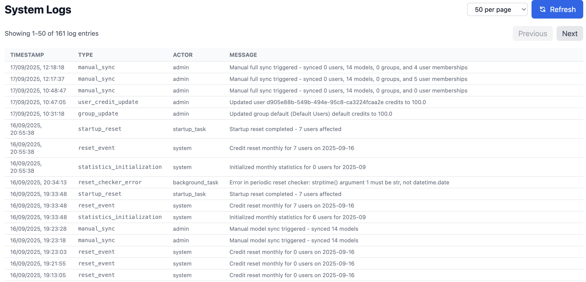
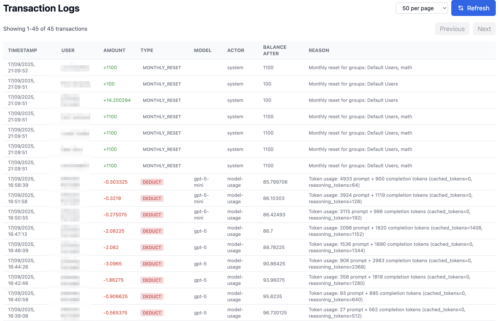
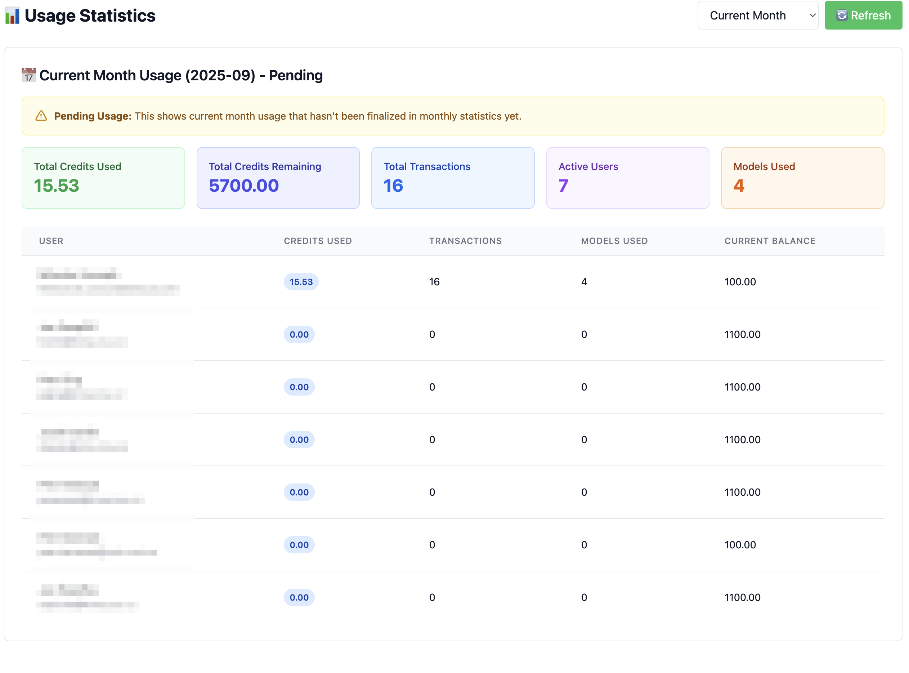
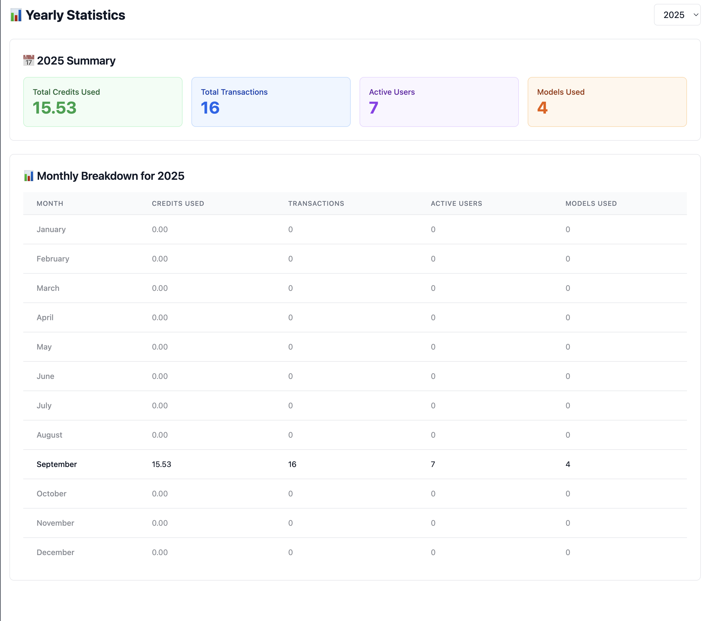

# 💳 OpenWebUI Credit System

A comprehensive credit management system for OpenWebUI with secure authentication, HTTPS support, and real-time user/model synchronization.

## 🚀 Features

- **💰 Credit Management**: Track and manage user credits with precision
- **🏷️ Public Pricing Page**: Modern, searchable pricing interface (no login required)
- **🔐 Secure Authentication**: JWT-based admin authentication + API key security
- **🔒 HTTPS Support**: Full SSL/TLS encryption with Let's Encrypt integration
- **🔄 Real-time Sync**: Automatic synchronization with OpenWebUI database
- **📊 Advanced Analytics**: Transaction logs and system monitoring
- **🎯 Optimized APIs**: Efficient endpoints for high-performance operations
- **🛡️ Input Validation**: Comprehensive security and data validation
- **📱 Modern UI**: Responsive admin interface with dark mode support
- **⚡ Smart Model Filtering**: Only shows available models to users

## 🔐 Security Features

- JWT-based authentication for admin interface
- API key authentication for extensions
- Password hashing with bcrypt
- HTTPS/SSL encryption support
- Request validation and sanitization
- Session management and auto-logout
- Comprehensive audit logging

## 🏃‍♂️ Quick Start

### 1. Setup and Installation

```bash
# Clone the repository
git clone <repository-url>
cd openwebui-credit-system/credit_admin

# Create virtual environment
uv venv venv
source venv/bin/activate  # On Windows: venv\Scripts\activate

# Install dependencies
# Using `pyproject.toml` (recommended)
# Use `uv` to lock, sync and run the project environment.
# Example workflow (from repository root):
uv sync --active
uv run python app/main.py

```

### 2. Security Configuration

```bash
# You can generate a secure `.env` automatically:
./generate-env.sh

# Or start from the example file shipped with the project:
# Copy `credit_admin/.env.example` to `credit_admin/.env` and edit values.
cp credit_admin/.env.example credit_admin/.env
nano credit_admin/.env

# View the configuration (masked for security)
./show-security-config.sh

# Edit `.env` to change `ADMIN_PASSWORD` or other values if desired
# (ensure you replace placeholder values like CHANGEME_* with real secrets)
```

### 3. HTTPS Setup with Nginx (Recommended for Production)

For production deployment, use nginx as a reverse proxy to handle SSL/TLS termination. This is more secure and allows both OpenWebUI and Credit Admin to run on the same domain.

```bash
# Step 1: Obtain Let's Encrypt certificate
cd credit_admin
./setup-ssl-production.sh yourdomain.com your-email@example.com

# Step 2: Nginx will be automatically configured to:
# - Handle HTTPS on port 443
# - Proxy / to OpenWebUI (port 8080)
# - Proxy /credits/* to Credit Admin (port 8081)
```

**Architecture:**
```
Browser (HTTPS)
    ↓
Nginx (port 443, TLS termination)
    ├→ /credits/* → http://localhost:8081/ (Credit Admin)
    └→ /*        → http://localhost:8080  (OpenWebUI)
```

**Alternative: Development Setup (Self-signed)**
```bash
# For local development only
./setup-ssl.sh
```

### 4. Run the Applications

```bash
# Start Credit Admin (runs on port 8081, plain HTTP)
bash run_credit_admin.sh

# Start OpenWebUI (runs on port 8080, plain HTTP)
bash run_openwebui.sh
```

**Note:** Both apps run plain HTTP behind nginx. Nginx handles all TLS encryption, keeping private keys secure (root-only access).

### 5. Install and Configure OpenWebUI Extensions

Import the functions from the `functions/` folder into the OpenWebUI functions.

Set these environment variables in your OpenWebUI function/extension setup so the extensions can securely talk to the Credit Admin API.

**Production Setup (with Nginx):**
```bash
# Use https when nginx handles TLS termination
CREDITS_API_PROTOCOL=https
# Use domain name without path (nginx routes /credits internally)
CREDITS_API_HOST=yourdomain.com
# True for valid Let's Encrypt certificates
CREDITS_API_SSL_VERIFY=true
# Exact API key from `credit_admin/.env` (view with ./show-security-config.sh)
CREDITS_API_KEY=your_generated_key_from_step_2
```

**Development Setup (Direct Access):**
```bash
# Use http for direct access during development
CREDITS_API_PROTOCOL=http
# Include port for direct access
CREDITS_API_HOST=localhost:8081
# False for self-signed or no SSL
CREDITS_API_SSL_VERIFY=false
# Exact API key from `credit_admin/.env` (view with ./show-security-config.sh)
CREDITS_API_KEY=your_generated_key_from_step_2
```

Images: the screenshots below show the OpenWebUI "Valves" (function configuration) UI with the same fields you must populate. Use these as a visual reference when adding the environment variables to your OpenWebUI function settings.

- Function configuration screenshot: `img/funct_config.png`
- Valves configuration screenshot: `img/valves.png`


Important notes:
- **API key must match**: The `CREDITS_API_KEY` you set in OpenWebUI must be identical to `CREDITS_API_KEY` in `credit_admin/.env` (run `./show-security-config.sh` to view it).
- **SSL with Nginx**: When using nginx as reverse proxy, use `CREDITS_API_PROTOCOL=https` and `CREDITS_API_SSL_VERIFY=true` with Let's Encrypt certificates. The nginx setup handles TLS termination automatically.
- **Direct access**: For development or direct access, use `http://localhost:8081` and `CREDITS_API_SSL_VERIFY=false`.
- **Host reachability**: Use domain name for production (nginx routing) or `localhost:8081` for direct access. No need to include `/credits` in the host - nginx handles path routing.
- **No hardcodes**: Do not edit extension source files to add keys — always use environment variables.

Quick verify (Production with Nginx):

```bash
curl -I --header "X-API-Key: $CREDITS_API_KEY" "https://yourdomain.com/credits/health"
```

Quick verify (Development):

```bash
curl -I --header "X-API-Key: $CREDITS_API_KEY" "http://localhost:8081/health"
```

Troubleshooting:
- If you see 401/403 responses, re-check the API key matches exactly and has no surrounding quotes or stray characters.
- If you get SSL errors, temporarily set `CREDITS_API_SSL_VERIFY=false` for local testing, or fix your certificate chain for production.
- If the function cannot reach the host, check firewall rules and that the Credit Admin server is listening on the expected interface/port.


## 📋 Access Points

### Production (with Nginx)
- **OpenWebUI**: https://yourdomain.com
- **Credit Admin Interface**: https://yourdomain.com/credits/
- **Public Pricing Page**: https://yourdomain.com/credits/pricing (no login required)
- **API Documentation**: https://yourdomain.com/credits/docs
- **Health Check**: https://yourdomain.com/credits/health

### Development (Direct Access)
- **Admin Interface**: http://localhost:8081 (or your configured PORT)
- **Public Pricing Page**: http://localhost:8081/pricing (no login required)
- **API Documentation**: http://localhost:8081/docs
- **Health Check**: http://localhost:8081/health

**Default Login**: `admin` / `admin123` (⚠️ Change immediately!)

**Port Configuration**: 
- Credit Admin default port: 8081 (configurable via `PORT` in `.env`)
- OpenWebUI default port: 8080
- Nginx listens on ports 80 (HTTP) and 443 (HTTPS)

### 🏷️ Public Pricing Features

The public pricing page provides:
- **Modern UI**: Responsive design with real-time search and sorting
- **Model Availability**: Only shows models currently available in OpenWebUI
- **Live Search**: Instant filtering by model name or ID
- **Smart Sorting**: Sort by name (A-Z, Z-A) or price (Low/High)
- **Flexible Pricing Units**: View prices per token, per 1K tokens (default), or per 1M tokens
- **No Authentication**: Public access for transparency

## 🔧 Configuration

### Environment Variables

The system uses a .env file in credit_admin/ for configuration. Generate with ./generate-env.sh and edit as needed.

Example .env content:
```bash
# Credit Admin Environment Configuration
# Generated on [date]
# ⚠️ CHANGE DEFAULT PASSWORD AND KEYS BEFORE PRODUCTION!

# Application
PORT=8081  # Default port (8000 if standalone, 8081 with nginx)
ENABLE_SSL=false  # Set to false when using nginx as TLS terminator

# Security
ADMIN_USERNAME=admin
ADMIN_PASSWORD=admin123
SECRET_KEY=your_generated_secret_key
CREDITS_API_KEY=your_generated_api_key
ACCESS_TOKEN_EXPIRE_MINUTES=30

# Database
OPENWEBUI_DATABASE_PATH=/root/.open-webui/webui.db

# Path Configuration
# ROOT_PATH=/credits  # NOT needed - nginx handles path routing
# JavaScript auto-detects BASE_PATH from browser URL

# Extensions (for OpenWebUI setup - copy these)
# Production (with nginx):
# CREDITS_API_PROTOCOL=https
# CREDITS_API_HOST=yourdomain.com
# CREDITS_API_SSL_VERIFY=true
# CREDITS_API_KEY=your_generated_api_key
#
# Development (direct):
# CREDITS_API_PROTOCOL=http
# CREDITS_API_HOST=localhost:8081
# CREDITS_API_SSL_VERIFY=false
# CREDITS_API_KEY=your_generated_api_key
```

### Extension Configuration

Place extension files in your OpenWebUI extensions directory:

- `credit_charging_filter.py` - Charges credits for usage
- `credit_management_enough_credits.py` - Blocks requests when insufficient credits
- `credit_management_models.py` - Shows model pricing information

**Configuration**: Extensions now load configuration from environment variables (no hardcodes). Set CREDITS_API_KEY, CREDITS_API_HOST, etc. in OpenWebUI environment as shown in Step 5.

## 📚 Documentation

- [HTTPS Setup Guide](HTTPS_SETUP.md) - Complete SSL/TLS configuration
- [Security Documentation](SECURITY.md) - Authentication and security features

## 🛠️ Development

## 🛠️ Development

### Project Structure

```
openwebui-credit-system/
├── credit_admin/              # Main application
│   ├── app/
│   │   ├── main.py           # FastAPI application
│   │   ├── auth.py           # Authentication system
│   │   ├── database.py       # Database operations
│   │   ├── config.py         # Configuration
│   │   ├── api/
│   │   │   ├── auth.py       # Auth endpoints
│   │   │   └── credits_v2.py # Credit management API
│   │   └── static/           # Web interface
│   ├── ssl/                  # SSL certificates
│   ├── data/                 # SQLite database
│   └── pyproject.toml       # Python dependencies (PEP 621)
├── extensions/               # OpenWebUI extensions
└── functions/               # OpenWebUI functions (export)
```

### API Endpoints

**Authentication:**
- `POST /auth/login` - Admin login
- `GET /auth/me` - Get current user
- `POST /auth/logout` - Logout

**Admin APIs (require JWT):**
- `GET /api/credits/users` - List all users
- `GET /api/credits/models` - List all models
- `POST /api/credits/update` - Update user credits
- `POST /api/credits/models/update` - Update model pricing

**Extension APIs (require API key):**
- `GET /api/credits/user/{user_id}` - Get user credits
- `GET /api/credits/model/{model_id}` - Get model pricing
- `POST /api/credits/deduct-tokens` - Deduct credits

### 🔌 API Endpoints

#### Public Endpoints (No Authentication)
- `GET /pricing` - Public pricing page with modern UI
- `GET /api/public/models/pricing` - JSON API for available model pricing
- `GET /health` - System health check

#### Admin Endpoints (JWT Authentication Required)
- `GET /api/credits/users` - List all users with credit information
- `GET /api/credits/models` - List all models with availability status
- `POST /api/credits/update` - Update user credits
- `POST /api/credits/models/update` - Update model pricing
- `POST /api/credits/sync-all` - Manual sync from OpenWebUI

#### Extension Endpoints (API Key Authentication)
- `GET /api/credits/user/{user_id}` - Get user credit information
- `GET /api/credits/model/{model_id}` - Get model pricing
- `POST /api/credits/deduct-tokens` - Deduct credits for token usage

### 📊 Model Availability Management

The system automatically tracks which models are available in OpenWebUI:
- **Efficient Sync**: Availability status cached locally during database sync
- **Real-time Updates**: Changes reflected immediately in public pricing
- **Admin Visibility**: Clear status indicators (✅ Available / ❌ Unavailable)
- **Performance**: No repeated database queries to OpenWebUI

### Database Schema

- `users` - User credit balances and group assignments
- `models` - Model pricing (context_price, generation_price)
- `groups` - Credit groups with default allocations
- `transactions` - Credit transaction history
- `system_logs` - System event logging

## 🚨 Troubleshooting

### Common Issues

1. **Login fails**: Check ADMIN_PASSWORD environment variable
2. **Extensions can't connect**: 
   - Verify CREDITS_API_KEY matches in both systems
   - For production: Use `https://yourdomain.com` (not `https://yourdomain.com/credits`)
   - For development: Use `http://localhost:8081`
3. **SSL errors**: 
   - With nginx and Let's Encrypt: Set `CREDITS_API_SSL_VERIFY=true`
   - Development/self-signed: Set `CREDITS_API_SSL_VERIFY=false`
4. **Static files not loading**: 
   - Ensure `ROOT_PATH` is commented out in `credit_admin/.env`
   - Verify nginx is stripping `/credits` prefix before proxying
5. **Redirects lose /credits prefix**: 
   - Check nginx `proxy_redirect` rules are configured
   - Verify JavaScript BASE_PATH auto-detection in `main.js`
6. **Database sync issues**: Check OpenWebUI database path and permissions
7. **404 errors on /credits paths**: Ensure nginx configuration is active and reloaded (`sudo nginx -t && sudo systemctl reload nginx`)


## 📖 User Manual

This section provides guidance on how to use the OpenWebUI Credit System effectively. Refer to the images below for visual assistance.

### User Manual (UI walkthrough)

Below are short, user-focused descriptions of the main UI pages shown in the screenshots. Each section includes an inline image for quick reference.

- **Admin Login**
	- Purpose: Secure entry for administrators.
	- Action: Enter your username and password, then click `Sign in`.
	- Tip: Change the default admin credentials after first login.
  
	

- **User Credit Management**
	- Purpose: See all users, their group memberships, current credit balances, and default credits.
	- Action: Use the `Edit` button to change a user's credits or group membership. Use `Export Users to Excel` to download a CSV/Excel snapshot.
	- Tip: Use `Sync All Data from OpenWebUI` after making changes in OpenWebUI to keep users and groups in sync.

	

- **Group Management**
	- Purpose: Define groups and their default credit amounts.
	- Action: Click `Edit` to change the default credits for a group. Use `Export Groups to Excel` to back up group definitions.
	- Tip: Changing a group's default does not automatically adjust every user's balance — update users individually if needed.

	


- **Model Pricing Management**
	- Purpose: Configure per-model pricing used when converting token usage into credits.
	- Action: Click `Edit` for a model to change context/generation prices. Click `Sync Models from OpenWebUI` to import new models.
	- Tip: Model pricing is available in the public pricing page /pricing.

	

- **Public Pricing Page**
	- Purpose: Public-facing page that shows current model pricing and availability (no login required).
	- What users see: Searchable grid of models with context and generation credits (per token unit), status badges, and quick filters (Name A–Z, Credits Low/High).
	- How to use: Share the `/pricing` URL with users so they can view model costs without administrative access.
	- API access: A JSON endpoint mirrors the public page for programmatic use: `GET /api/public/models/pricing`.

		


- **Dashboard / System Logs**
	- Purpose: View recent system events such as manual syncs, resets, and background job errors.
	- Action: Use `Refresh` to reload entries; use pagination to view older logs.
	- Tip: Look for `manual_sync`, `reset_event`, and `startup_reset` entries to confirm syncs and resets.

	


- **Transaction Logs**
	- Purpose: Audit trail of per-user credit transactions including deductions and resets.
	- Action: Inspect `Reason` and `Model` columns for details about deductions; use timestamps to correlate events.
	- Tip: Red entries indicate deductions; green entries indicate credits added (e.g., monthly resets).

	

- **Usage Statistics and Yearly Stats**
	- Purpose: Summary and historical views for credits used, remaining credits, number of transactions, active users, and models used.
	- Action: Choose period (Current Month / Year), then click `Refresh` to update the data.
	- Tip: Use these reports for billing or trend analysis.

	

	

## 📄 License

This project is licensed under the MIT License - see the [licence.txt](licence.txt) file for details.


