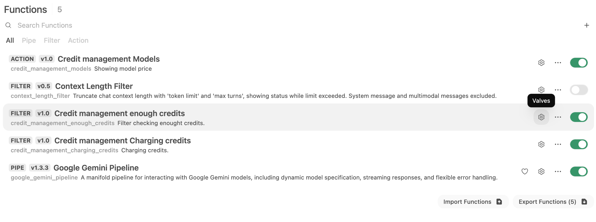
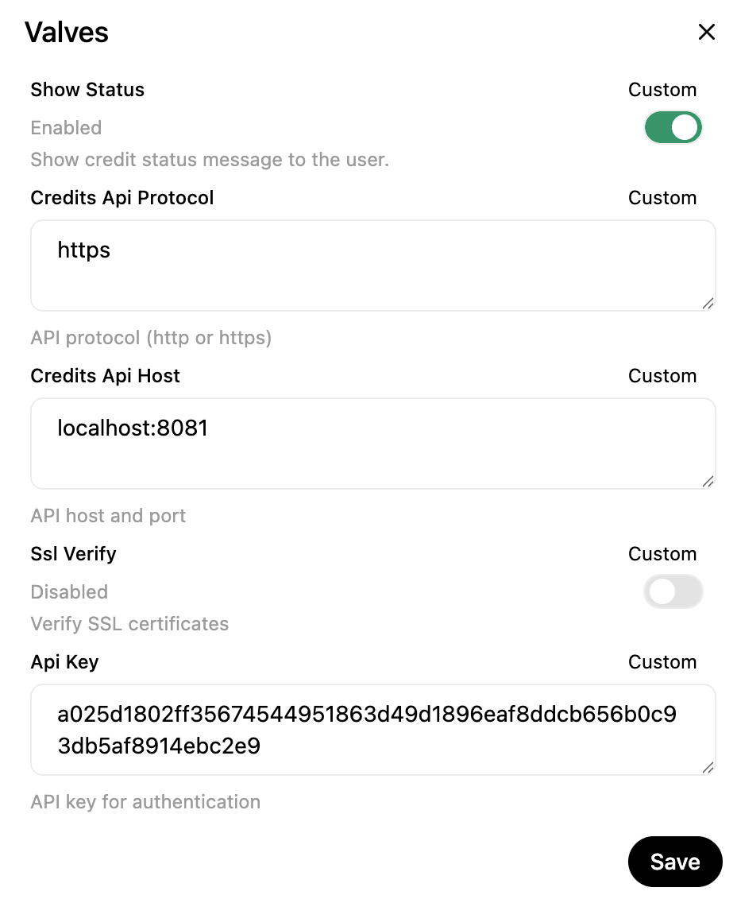

# 💳 OpenWebUI Credit System

A comprehensive credit management system for OpenWebUI with secure authentication, HTTPS support, and real-time user/model synchronization.

## 🚀 Features

- **💰 Credit Management**: Track and manage user credits with precision
- **🏷️ Public Pricing Page**: Modern, searchable pricing interface (no login required)
- **🔐 Secure Authentication**: JWT-based admin authentication + API key security
- **🔒 HTTPS Support**: Full SSL/TLS encryption with Let's Encrypt integration
- **🔄 Real-time Sync**: Automatic synchronization with OpenWebUI database
- **📊 Advanced Analytics**: Transaction logs and system monitoring
- **🎯 Optimized APIs**: Efficient endpoints for high-performance operations
- **🛡️ Input Validation**: Comprehensive security and data validation
- **📱 Modern UI**: Responsive admin interface with dark mode support
- **⚡ Smart Model Filtering**: Only shows available models to users

## 🔐 Security Features

- JWT-based authentication for admin interface
- API key authentication for extensions
- Password hashing with bcrypt
- HTTPS/SSL encryption support
- Request validation and sanitization
- Session management and auto-logout
- Comprehensive audit logging

## 🏃‍♂️ Quick Start

### 1. Setup and Installation

```bash
# Clone the repository
git clone <repository-url>
cd openwebui-credit-system/credit_admin

# Create virtual environment
uv venv venv
source venv/bin/activate  # On Windows: venv\Scripts\activate

# Install dependencies
# Using `pyproject.toml` (recommended)
# Use `uv` to lock, sync and run the project environment.
# Example workflow (from repository root):
uv sync --active
uv run python app/main.py

```

### 2. Security Configuration

```bash
# Generate secure .env file with keys and configuration
./generate-env.sh

# View the configuration (masked for security)
./show-security-config.sh

# Edit .env to change ADMIN_PASSWORD if desired
nano .env
```

### 3. HTTPS Setup (Optional)

```bash
# For development (self-signed)
./setup-ssl.sh

# For production (Let's Encrypt)
./setup-ssl-production.sh yourdomain.com your-email@example.com
```

### 4. Run the Application

```bash
bash run_credit_admin.sh
```

### 5. Configure OpenWebUI Extensions

Set these environment variables in your OpenWebUI function/extension setup so the extensions can securely talk to the Credit Admin API.

```bash
# Use `http` or `https` depending on your Credit Admin setup
CREDITS_API_PROTOCOL=http
# Host and port where the Credit Admin API is reachable from OpenWebUI
CREDITS_API_HOST=localhost:8000
# For self-signed certs set to `false`; set to `true` for valid CA-signed certs
CREDITS_API_SSL_VERIFY=false
# Exact API key from `credit_admin/.env` (view with ./show-security-config.sh)
CREDITS_API_KEY=your_generated_key_from_step_2
```

Images: the screenshots below show the OpenWebUI "Valves" (function configuration) UI with the same fields you must populate. Use these as a visual reference when adding the environment variables to your OpenWebUI function settings.

- Function configuration screenshot: `img/funct_config.png`
- Valves configuration screenshot: `img/valves.png`





Important notes:
- **API key must match**: The `CREDITS_API_KEY` you set in OpenWebUI must be identical to `CREDITS_API_KEY` in `credit_admin/.env` (run `./show-security-config.sh` to view it).
- **SSL**: If `ENABLE_SSL=true` in `credit_admin/.env` and you have valid CA-signed certificates, use `CREDITS_API_PROTOCOL=https` and set `CREDITS_API_SSL_VERIFY=true`. For local/self-signed certs use `https` + `CREDITS_API_SSL_VERIFY=false`.
- **Host reachability**: From the OpenWebUI host/process, `CREDITS_API_HOST` must be reachable (include port if non-standard). When running both services locally use `localhost:8000` (or the port configured).
- **No hardcodes**: Do not edit extension source files to add keys — always use environment variables.

Quick verify (from OpenWebUI host):

```bash
curl -I --header "X-API-Key: $CREDITS_API_KEY" "$CREDITS_API_PROTOCOL://$CREDITS_API_HOST/health"
```

Troubleshooting:
- If you see 401/403 responses, re-check the API key matches exactly and has no surrounding quotes or stray characters.
- If you get SSL errors, temporarily set `CREDITS_API_SSL_VERIFY=false` for local testing, or fix your certificate chain for production.
- If the function cannot reach the host, check firewall rules and that the Credit Admin server is listening on the expected interface/port.


## 📋 Access Points

- **Admin Interface**: https://localhost:8000 (or your configured PORT)
- **Public Pricing Page**: https://localhost:8000/pricing (no login required)
- **API Documentation**: https://localhost:8000/docs
- **Health Check**: https://localhost:8000/health

**Default Login**: `admin` / `admin123` (⚠️ Change immediately!)

**Port Configuration**: The default port is 8000, but you can change it using the `PORT` environment variable.

### 🏷️ Public Pricing Features

The public pricing page provides:
- **Modern UI**: Responsive design with real-time search and sorting
- **Model Availability**: Only shows models currently available in OpenWebUI
- **Live Search**: Instant filtering by model name or ID
- **Smart Sorting**: Sort by name (A-Z, Z-A) or price (Low/High)
- **Flexible Pricing Units**: View prices per token, per 1K tokens (default), or per 1M tokens
- **No Authentication**: Public access for transparency

## 🔧 Configuration

### Environment Variables

The system uses a .env file in credit_admin/ for configuration. Generate with ./generate-env.sh and edit as needed.

Example .env content:
```bash
# Credit Admin Environment Configuration
# Generated on [date]
# ⚠️ CHANGE DEFAULT PASSWORD AND KEYS BEFORE PRODUCTION!

# Application
PORT=8000
ENABLE_SSL=false

# Security
ADMIN_USERNAME=admin
ADMIN_PASSWORD=admin123
SECRET_KEY=your_generated_secret_key
CREDITS_API_KEY=your_generated_api_key
ACCESS_TOKEN_EXPIRE_MINUTES=30

# Database
OPENWEBUI_DATABASE_PATH=/root/.open-webui/webui.db

# Extensions (for OpenWebUI setup - copy these)
# CREDITS_API_PROTOCOL=http
# CREDITS_API_HOST=localhost:8000
# CREDITS_API_SSL_VERIFY=false
# CREDITS_API_KEY=your_generated_api_key
```

### Extension Configuration

Place extension files in your OpenWebUI extensions directory:

- `credit_charging_filter.py` - Charges credits for usage
- `credit_management_enough_credits.py` - Blocks requests when insufficient credits
- `credit_management_models.py` - Shows model pricing information

**Configuration**: Extensions now load configuration from environment variables (no hardcodes). Set CREDITS_API_KEY, CREDITS_API_HOST, etc. in OpenWebUI environment as shown in Step 5.

## 📚 Documentation

- [HTTPS Setup Guide](HTTPS_SETUP.md) - Complete SSL/TLS configuration
- [Security Documentation](SECURITY.md) - Authentication and security features

## 🛠️ Development

## 🛠️ Development

### Project Structure

```
openwebui-credit-system/
├── credit_admin/              # Main application
│   ├── app/
│   │   ├── main.py           # FastAPI application
│   │   ├── auth.py           # Authentication system
│   │   ├── database.py       # Database operations
│   │   ├── config.py         # Configuration
│   │   ├── api/
│   │   │   ├── auth.py       # Auth endpoints
│   │   │   └── credits_v2.py # Credit management API
│   │   └── static/           # Web interface
│   ├── ssl/                  # SSL certificates
│   ├── data/                 # SQLite database
│   └── pyproject.toml       # Python dependencies (PEP 621)
├── extensions/               # OpenWebUI extensions
└── functions/               # OpenWebUI functions (export)
```

### API Endpoints

**Authentication:**
- `POST /auth/login` - Admin login
- `GET /auth/me` - Get current user
- `POST /auth/logout` - Logout

**Admin APIs (require JWT):**
- `GET /api/credits/users` - List all users
- `GET /api/credits/models` - List all models
- `POST /api/credits/update` - Update user credits
- `POST /api/credits/models/update` - Update model pricing

**Extension APIs (require API key):**
- `GET /api/credits/user/{user_id}` - Get user credits
- `GET /api/credits/model/{model_id}` - Get model pricing
- `POST /api/credits/deduct-tokens` - Deduct credits

### 🔌 API Endpoints

#### Public Endpoints (No Authentication)
- `GET /pricing` - Public pricing page with modern UI
- `GET /api/public/models/pricing` - JSON API for available model pricing
- `GET /health` - System health check

#### Admin Endpoints (JWT Authentication Required)
- `GET /api/credits/users` - List all users with credit information
- `GET /api/credits/models` - List all models with availability status
- `POST /api/credits/update` - Update user credits
- `POST /api/credits/models/update` - Update model pricing
- `POST /api/credits/sync-all` - Manual sync from OpenWebUI

#### Extension Endpoints (API Key Authentication)
- `GET /api/credits/user/{user_id}` - Get user credit information
- `GET /api/credits/model/{model_id}` - Get model pricing
- `POST /api/credits/deduct-tokens` - Deduct credits for token usage

### 📊 Model Availability Management

The system automatically tracks which models are available in OpenWebUI:
- **Efficient Sync**: Availability status cached locally during database sync
- **Real-time Updates**: Changes reflected immediately in public pricing
- **Admin Visibility**: Clear status indicators (✅ Available / ❌ Unavailable)
- **Performance**: No repeated database queries to OpenWebUI

### Database Schema

- `users` - User credit balances and group assignments
- `models` - Model pricing (context_price, generation_price)
- `groups` - Credit groups with default allocations
- `transactions` - Credit transaction history
- `system_logs` - System event logging

## 🔄 Migration from v1.0

The system automatically migrates from JSON files to SQLite on first run. See [REFACTORING_SUMMARY.md](REFACTORING_SUMMARY.md) for details.

## 🚨 Troubleshooting

### Common Issues

1. **Login fails**: Check ADMIN_PASSWORD environment variable
2. **Extensions can't connect**: Verify CREDITS_API_KEY matches in both systems
3. **SSL errors**: Use `CREDITS_API_SSL_VERIFY=false` for self-signed certificates
4. **Database sync issues**: Check OpenWebUI database path and permissions

### Debugging

```bash
# Check security configuration
./show-security-config.sh

# Test API connectivity
curl -H "X-API-Key: your_api_key" https://localhost:8000/health

# View logs
docker-compose logs -f  # For Docker deployment
python app/main.py      # For direct run
```

## 📄 License

This project is licensed under the MIT License - see the [licence.txt](licence.txt) file for details.

## 🤝 Contributing

1. Fork the repository
2. Create a feature branch
3. Make your changes
4. Add tests if applicable
5. Submit a pull request

## 📞 Support

For issues and questions:
- Check the documentation in this repository
- Review the troubleshooting section
- Check existing issues in the issue tracker

---

**⚠️ Security Notice**: Always change default credentials before production use!

